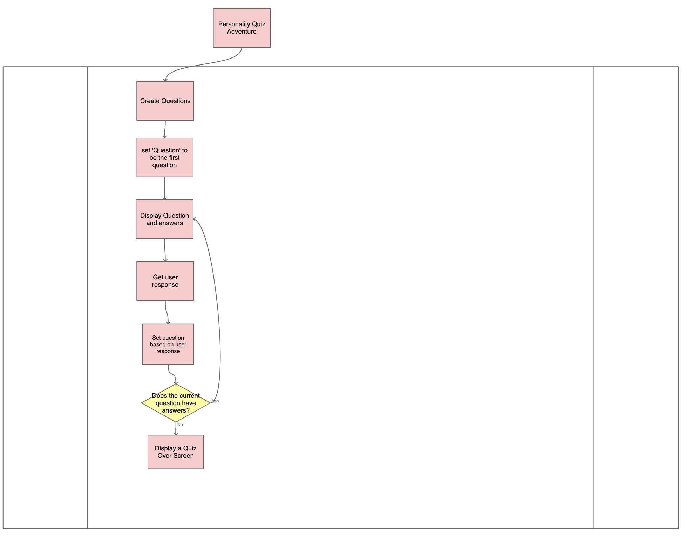
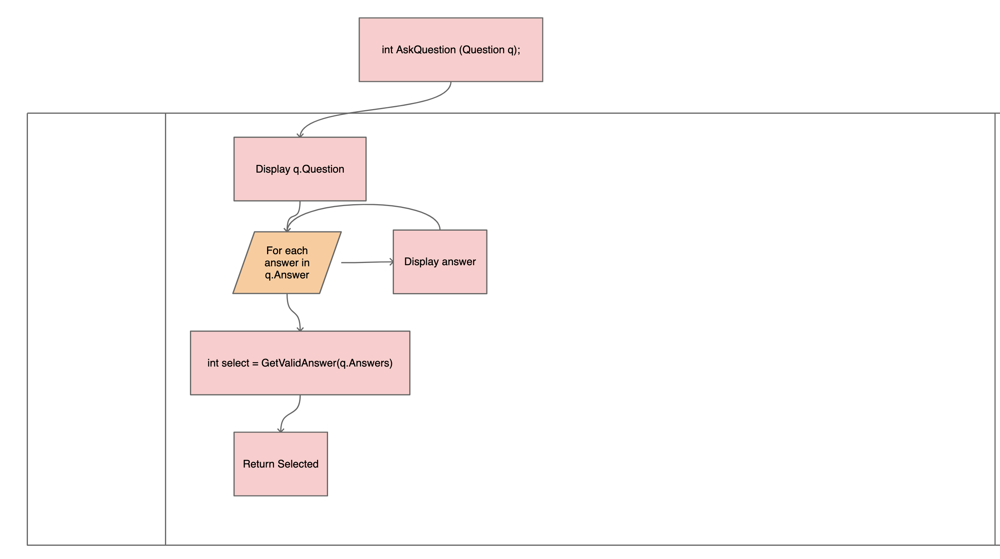
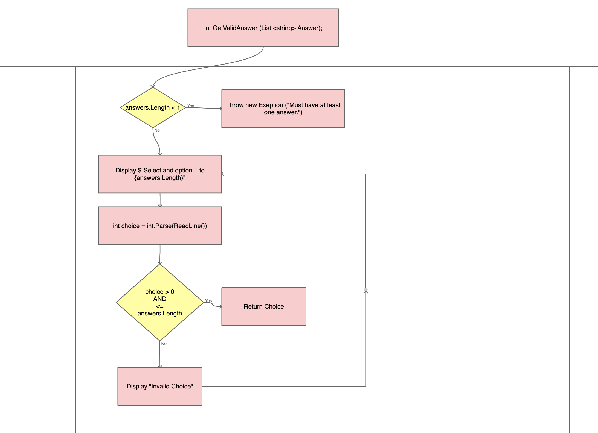

# PersonalityQuizAdventure

## Description:

#### This personality quiz adventure to determine which anime you should watch next! There will be five possible anime recommendation made based on the players personality.

## OverView:
#### The ultimate goal of the Personality Quiz Adventure is to entertain the user and help them discover a new anime to watch. The Personality Quiz Adventure functions by giving the user questions and questions based on the answer to the previous questions. Ultimately, the quiz ends by giving the user the results of their quiz.

## High Level Design:
#### 1. Starts by creating the questions
#### 2. Sets 'Questions' to be the first question
#### 3. Displays questions and answers 
#### 4. Receives users response
#### 5. Sets questions based on users response
#### 6. Checks if the current question has an answer and loops back to 'Displays questions and answers' otherwise....
#### 7. Displays a Game Over screen

### FlowChart:

## Methods and Classes:
#### The two methods I have chosen are:
#### - static int AskQuestion(Question)
#### - static int GetValidAnswer(List<string> answer);

### Question Class:
#### - List<string>answer
#### - List<Question>result
#### - String Question

## static int AskQuestion(Question)

#### 1. Display the question
#### 2. Loop through each answer and display it
#### 3. Use the GetValidAnswer method to get the user's response
#### 4. Return the user's response

## static int GetValidAnswer(List<string> answers);

#### 1. Validate that there is at least 1 possible answer.
#### 2. If the list of answers is empty, throw an exception
#### 3. Otherwise, Display a message asking the user to select an option.
#### 4. Store the user's response in a variable name choice
#### 5. Validate that choice is one of the possible answers
#### 6. If it is not a valid answer
#### - Display an error message
#### - Go to 3
#### 7. Otherwise, return the user's choice.